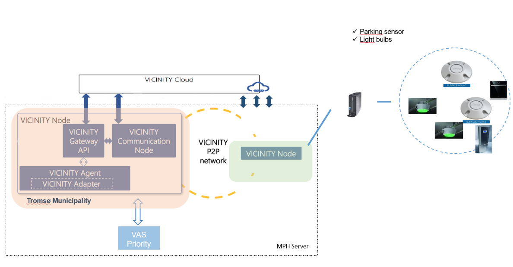

# HITS - PNI Adapter
## Architecture
The adapter bridges communication between the PNI cloud and the VICINITY agent. The adapter consumes the aforementioned endpoints and produces the appropriate data.



## Installation

### Set user environment:

Install JDK 1.8
Install Postgresql 9.6.8
Install maven

### Download the source code from the repository:

`$ git clone git@github.com:vicinityh2020/vicinity-adapter-hits.git`

You need to set user variables to run the adapter on your environment.
To let Maven work everywhere you need to export following environmental variables:

`M2_HOME=/usr/local/apache-maven/apache-maven-3.5.3`
`M2=$M2_HOME/bin`
`MAVEN_OPTS=-Xms256m -Xmx512m`

Now append the M2 variable to the system path:

`PATH=$M2:$PATH`

Finally, verify if Maven has been added by running:

`$ mvn -version`

The output should be as follows:
```
Apache Maven 3.5.3 (7994120775791599e205a5524ec3e0dfe41d4a06; 2016-12-03T17:27:37+05:30)
Maven home: /usr/local/apache-maven/apache-maven-3.3.9
 
Java version: 1.8.0_75, vendor: Oracle Corporation
 
Java home: /usr/local/java-current/jdk1.8.0_75/jre
```

Now you need to set PNI cloud variables inside application.properties for connection on your environment. 

`pnicloud.client.baseurl=api.pnicloud.com`
`pnicloud.client.apikey=YOUR_API_KEY <provided by PNI Cloud>`
`pnicloud.client.apiversion=api`


### DB Config

You need to set variables for your database. This variables should match the variables you use on your adapter for connection.

Following are the variables you should use on your machine.
```
PATH=/home/opt/PostgreSQL/9.6/bin:$PATH
PGDATA=/home/opt/PostgreSQL/9.6/data
PGDATABASE=YOUR_DB_NAME
PGUSER=USER_NAME
PGPASSWORD=USER_PASSWORD
PGPORT=YOUR_PORT
PGLOCALEDIR=/home/opt/PostgreSQL/9.6/share/locale
MANPATH=$MANPATH:/home/opt/PostgreSQL/9.6/share/man
```

Finally, alter your `application.properties` datasource properties to reflect your DB configurations

```java
spring.datasource.url=jdbc:postgresql://localhost:<psql_port>/<psql_dbname>
spring.datasource.username=<psql_username>
spring.datasource.password=<psql_password>
```

## Compilation & Running using Maven
To compile when in the root folder of the project:

`mvn clean install`

In case compilation fails due to failing tests - it is possible to ignore tests running:

`mvn clean install -DskipTests`

To run the adapter use the .jar from ./target directory.

`java -jar target/adapter-0.0.1-SNAPSHOT.jar`


Alternatively to all of the above, you may use this to quickly compile & run the adapter: 

`$ mvn spring-boot:run`


## Endpoints

We have implemented endpoints in our adapter to read information about devices. These endpoints are:

`GET /objects`
`GET /objects/{oid}/properties/{pid}`


`GET /objects`
Returns all devices registered at the adapter.

`GET /objects/{oid}/properties/{pid}`
Returns last known value and time the value was received by the device. “oid” is UUID of device and “pid” is a property identifier.